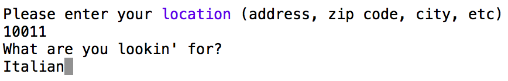

Mealee is designed to help the indecisive among us and is built using the Yelp Fusion API.  Mealee pulls local business data based on the user's search and matchs businesses side by side, allowing the user to narrow their choices until they find something they would like.  Mealee keeps track of individual users by name, saving their previous search location and top voted locations.  Users can view their top restaurants as well as the most voted restaurants overall.

While Mealee is built for restaurants, any search term that the Yelp API accepts will work, so you can also use Mealee to search for museums, or autobody shops, or hats!

USING MEALEE

Start Mealee by running 'ruby bin/run.rb' in your terminal from the main folder.

Enter your name to start.  If your name exists in the the database, Mealee will know your previous search location and top ten businesses.

Once you enter your name, you will be given three options, play Mealee, view your top restaurants, or view the community's top restaurants.

If you choose to play the game, if this is the first time playing, you will be prompted enter your location.  Otherwise, your previous location wil appear and you will be asked if you want to use that location or not.

Once location is determined, you will be asked for a search term.  Enter any sort of food category, cuisine, meal type, etc... Yelp will generate 40 restaurants based on your search terms.  Mealee randomly selects 10 of those returned restaurants, then choose two out of those 10 to display.  

As the user, you will be prompted to enter 1 or 2 as a winner of the round.  You may also enter 1! or 2! if you see an option that is your final decision.  Typing 'more' here will open up the two Yelp pages for these restaruants for additional information. Typing 'help' will provide a short explanation of the game, and 'exit' will end the game.

At the end of the ten options, the winner will be presented.  If you are satisfied, typing 'yes' will open the Yelp page for the winner.  Otherwise, you can choose to go through an additional 10 restaurants, and start the matchups again.  The restaurants will not repeat in the match ups unless you run the game again.

DATABASE INFORMATION

There are User and Restaurant classes in Mealee that handle the instances of users and restaurants.  These are both tied to database tables through ActiveRecord, and use Winner and Loser joiner tables to store user votes.

Mealee comes with a Rake file that allows you to utilize a few additional class methods for handling the user, restaurant, winner and loser tables. For instance, you can call methods for the total wins or losses for a specific restaurant or user, or even the biggest losers, or least favorite by user.